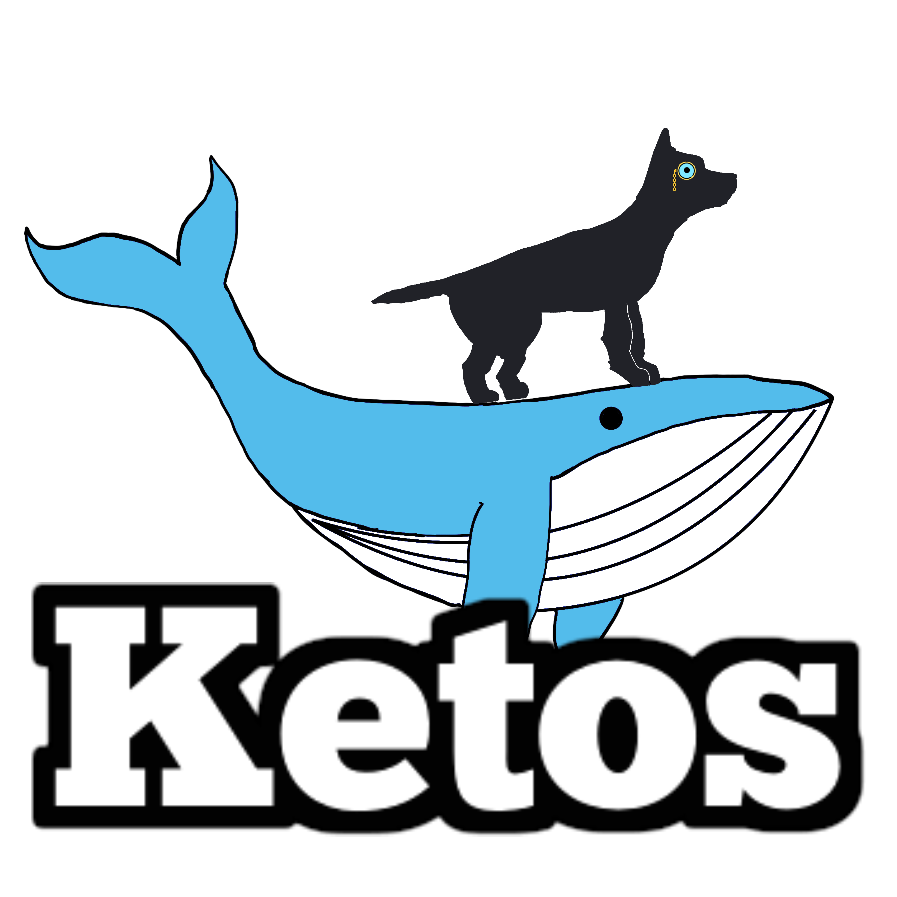

     
    
    <h1 align="center">A Docker Forensics Platform for Static and Dynamic Analysis</h1>

    <i>Ketos is a MERN stack application for analysing Docker images, containers and much more!</i> 
    <i>Fully modular and hot-swappable!</i>
      
    
    
      
    

## Documentation

Get started with Ketos

-   [Setup](#setup)
-   [Contributors](#Contributors)

## Setup

To setup, simply run `docker compose up -d` in the root directory of the project

API is hosted on port 3000, and UI is hosted on port 8080

Documentation and more information can found in the [wiki](https://github.com/PlatyPew/Ketos/wiki)

## Contributors

This project would not exist without these folks!

-   [@PlatyPew](https://github.com/PlatyPew)
-   [@Terence2389](https://github.com/Terence2389)
-   [@PototoPatata](https://github.com/PototoPatata)
-   [@Elsonnnn](https://github.com/Elsonnnn)
